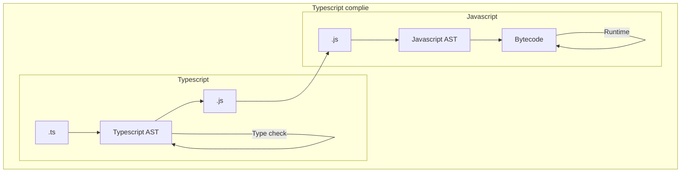
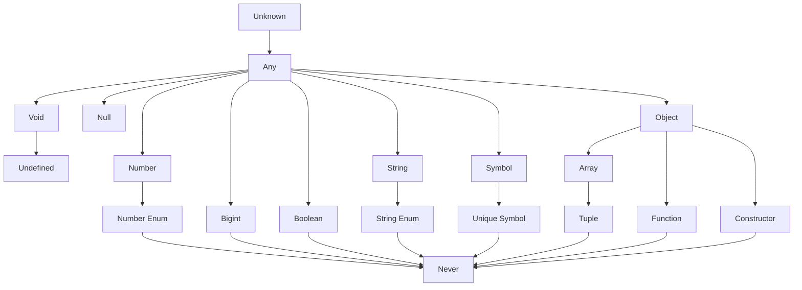

# Type system

> Welcome to typescript world

개발자를 너무 믿었던 자바스크립트의 undefined가 우리를 피곤하게 만들었다.

타입을 도입해서 피곤함에서 벗어나보자.


## 1. Typescript compiler

뭐 다른 언어들이 그렇듯 타입스크립트 역시 컴파일 과정이 있다.

다만 독특한 부분은 컴파일 결과가 자바스크립트 라는 것.(시스템에 따라 다르겠지만)

보통의 컴파일과정은 파싱 이후 AST를 만들고 바이트코드로 변환 후 런타임 평가가 되는데

타입스크립트는 AST로 만들고 타입체킹을 한다.




## 2. Type inference

타입스크립트 컴파일러는 두 가지 타입지정 방식이 있다.

개발자가 어노테이션을 이용해 직접 지정하는 방식과 타입스크립트가 추론하게 하는 방식이다.

1. Explicit type inference

```typescript
let a: number = 1 // a는 number
let b: string = 'hello' // b는 string
let c: boolean[] = [true, false] // c는 boolean 배열
```

2. Implicit type inference

```typescript
let a = 1 // a는 number
let b = 'hello' // b는 string
let c = [true, false] // c는 boolean 배열
```

코드를 줄이기위해 Implicit하게 쓰자. 대신 타입 변환할 때는 반드시 명시적으로 해야한다.


**타입스크립트는 gradually typed 언어다.**

프로그램의 모든 타입을 컴파일러가 알고 있을 때 최상의 결과를 도출하지만 모든 타입을 알아야 할 필요는 없다.

- **자바스크립트**는 개발자의 의도를 최대한 해석해서 `3+[1]` 을 31로 암시적 변환 후 평가한다.

- **타입스크립트는** `+` 연산자를 3과 [1]의 타입에 적용할 수 없어 에러를 도출한다.

- **타입스크립트**는 컴파일 타임에 코드의 타입을 확인하기 때문에 실행 전에 문법에러와 타입에러 모두를 검출한다.


## 3. Type definition

타입시스템은 어떤 값이 `T` 타입이면 이 값을 가지고 어떤 일을 할 수 있는지, 없는지 알 수 있게 도와준다.

또한 경계로도 생각 할 수 있는데 어떤 변수 `V` 의 타입이 `T` 라면 

상위한정 값이  `T` 이고  `V` 에 전달하는 모든 값은  `T`  이하여야 한다.

1) 타입스크립트의 전체 타입 다이어그램



   아래의 코드를 보자.

```typescript
function sqaureOf(n) {
	return n*n
}
sqaureOf(2) // 4
squareOf('z') // NaN
```

거듭제곱 연산은 숫자에 대한 연산이고 숫자로 파라미터를 받는 것이 명확한 연산이다.

숫자가 아닌 다른 타입을 전달하면 유효하지 않은(예측불가한) 연산을 수행한다.

```typescript
function squareOf(n: nummber) { // 타입 어노테이션(명시적 정의)
  return n*n
}
squareOf(n) // 4
squareOf(n) // Error TS2345: "z"라는 타입의 인수는 'number'타입의 매개변수에 할당불가
```

명시적 타입으로 컴파일 타임에 에러를 잡아낼 수 있다.

각각의 타입을 상세하게 알아보자

###  Any

Any는 